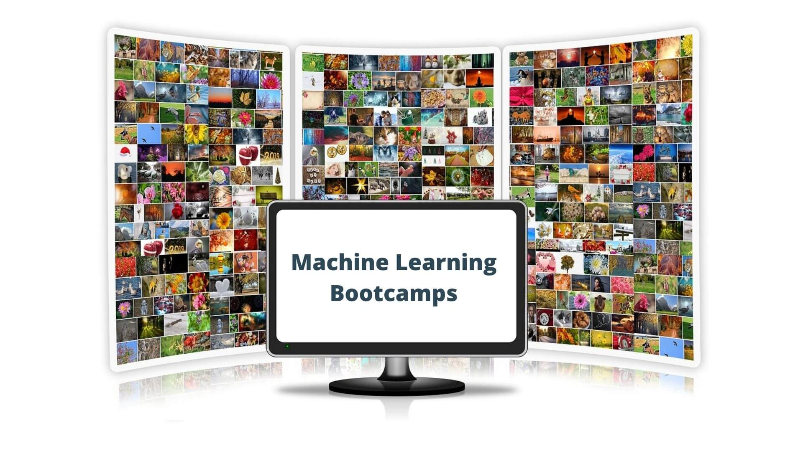

# Best bootcamps and programs to learn Machine Learning and Data Science

Bootcamps and interactive online platforms are an excellent way to acquire new skills. When it comes to Machine Learning and Data Science, there are a variety of different choices that one can choose from. Some provide onsite training and some online. Some focus on video courses, while others on real-life coding projects. In this list, I hope to outline all the most popular choices and help you pick the one that fits your learning style.

For each program, I’ll present a rating borrowed from [Switchup](https://www.switchup.org/), its different locations, an average duration and a handful of recommended courses around Machine Learning and Data Science.

> Switchup is an online platform that gathers resources and information about tech bootcamps and programs. It has compiled alumni reviews for each program alongside with guides and community discussions.

Disclaimer: We couldn’t possibly try out each bootcamp and program, so the information comes from their websites, alumni reviews, and thorough research on the web.

### Udacity

[Udacity](https://www.udacity.com/) is an online platform that offers both free and paid courses. Nanodegree programs are a collection of related courses that combine theoretical knowledge and hands-on experience. Most programs are taught by industry experts and are supported by big tech companies. They also provide mentor support as well as career services( resume building, github profile etc)

**Switchup rating**: 4.55/5

**Location**: Online

**Duration**: 4-8 months

**Recommended courses**: [Deep Learning Nanodegree](https://www.udacity.com/course/deep-learning-nanodegree--nd101), [Become a Machine Learning Engineer Nanodegree](https://www.udacity.com/course/machine-learning-engineer-nanodegree--nd009t), [AI Programming with Python](https://www.udacity.com/course/ai-programming-python-nanodegree--nd089)

### Springboard

[Springboard](https://www.springboard.com/) has a great variety of online bootcamp that covers a variety of topics from Software Engineering to Cybersecurity and Machine Learning. The courses are self-paced and come with one-on-one weekly mentor support, career coaching and a large alumni community,

**Switchup rating**: 4.59/5

**Location**: Online

**Duration**: 2-6 months

**Recommended courses**: [Data Science Track](https://www.springboard.com/courses/data-science-career-track/), [Machine Learning Engineering Career Track ](https://www.springboard.com/courses/ai-machine-learning-career-track/)

### NYC Data Science Academy

[NYC Data Science Academy](https://nycdatascience.com/) is a well-established Bootcamp that focuses on Data Science. You can expect to learn skills such as Data exploration, Data analysis, Python, R, Hadoop, Spark and more. It counts over 2000 alumni, works together with 500 hiring partners and has a community of almost 7000 members.

**Switchup rating**: 4.89/5

**Location**: Online, New York City

**Duration**: 1-3 months

**Recommended courses**: [Data Science with Python: Machine Learning](https://nycdatascience.com/courses/data-science-with-python-machine-learning/), [Deep Learning (with TensorFlow 2, Keras and PyTorch)](https://nycdatascience.com/courses/deep-learning/)

### Data Science Dojo

[Data Science Dojo](https://datasciencedojo.com/) offers both online and in-person training. It has one of the most comprehensive Data Science curriculum teaching topics such as Machine Learning, Data Analytics, ETL, Python, Data Science for Managers and Business Leaders. You may also find yourself working on an IoT project, participating in a Kaggle competition or landing an internship in a tech company. They have helped more than 5,000 graduates that are now working in 1,500 different companies. 

**Switchup rating**: 4.96/5

**Location**: Online, Seattle, Silicon Valley, Barcelona, Toronto, Washington, Paris and more

**Duration**: 5 days - 4 months

**Recommended courses**: [Data Science Bootcamp](https://datasciencedojo.com/data-science-bootcamp/), [Data Science Training + Industry Experience](https://datasciencedojo.com/data-science-training-and-internship/)

### BrainStation

[BrainStation](https://brainstation.io/) offers corporate training, diploma programs, certificate courses, workshops, and events both online and on-premises. You can expect to learn Data Fundamentals, Analysis for Data Science, Machine Learning Techniques, Big data fundamentals and Professional development. The curriculum is highly collaborative and focuses on real-life projects and applications.

**Switchup rating**: 4.74/5

**Location**: Online, New York, Miami, Toronto, Vancouver, London, and more

**Duration**: 3 months

**Recommended courses**: [Data Science Bootcamp](https://brainstation.io/course/online/remote-data-science-bootcamp)

### GreyAtom School of Data Science

[GreyAtom School of Data Science](https://greyatom.com/) has 2 main tracks: Data Science with Artificial Intelligence and Frontend Web Development. Their well-structured programs and live training sessions with industry mentors enable students to build their portfolio, strengthen their coding skills, prepare for technical interviews, and land jobs in top-tier companies.

**Switchup rating**: 4.91/5

**Location**: Online

**Duration**: 8 months

**Recommended courses**: [Data Science with Artificial Intelligence Carrer Track Program](https://greyatom.com/data-science-and-artificial-intelligence-course/)

### DataCamp

[DataCamp](https://www.datacamp.com/) is an online platform that offers more than 350 courses on a variety of data related topics such as Business Intelligence, Statistics,  Data Science, and Machine Learning. You can participate in online training for both non-coding tools as well as software development. A big plus is their very interactive platform which will make learning enjoyable.

**Switchup rating**: 4.6/5

**Location**: Online

**Duration**: 60-90 hours

**Recommended courses**: [Machine Learning Scientist with Python](https://www.datacamp.com/tracks/machine-learning-scientist-with-python), [Machine Learning Scientist with R ](https://www.datacamp.com/tracks/machine-learning-scientist-with-r)

### Dataquest

[Dataquest](https://www.dataquest.io/) is another online platform gives emphasis to interactive learning and hands-on learning. They include many real-life projects in their courses and urge students to write code as much as possible. Students also receive 1-on-1 coaching from the instruction team and the opportunity to practice and develop peer mentorship skills

**Switchup rating**: 4.92/5

**Location**: Online

**Duration**: 6 months

**Recommended courses**: [Data Scientist in Python](https://www.dataquest.io/path/data-scientist/), [Data Analyst in Python](https://www.dataquest.io/path/data-analyst/) 

### RMOTR

[RMOTR](https://rmotr.com/) school’s big advantages are its well-curated curriculum with 100+ courses which also includes over 20 industry-inspired projects ( using Github) and 200 short exercises. Since learning Data Science and Machine Learning can be overwhelming, they make sure to offer a clear path for the student, who is able to track its progress and navigate upcoming lessons.

**Switchup rating**: 4.85/5

**Location**: Online

**Duration**: 5-30 hours

**Recommended courses**: [Intro to Pandas for Data Analysis](https://rmotr.com/intro-to-pandas-for-data-analysis/), [Data Cleaning with Pandas](https://rmotr.com/data-cleaning-with-pandas/)

### Simplilearn

[Simplilearn](https://www.simplilearn.com/) is another online bootcamp but not an ordinary one. Its offerings are Post Graduate Programs that last 6-12 months, Master's Programs that last 1-2 years, and individual Certification Courses. It was founded back in 2009 and it remains one of the leading providers of online certification training 

**Switchup rating**: 4.66/5

**Location**: Online

**Duration**: 6-12 months

**Recommended courses**:[ Post Graduate Program in AI and Machine Learning by Purdue University](https://www.simplilearn.com/pgp-ai-machine-learning-certification-training-course), [Post Graduate Program in Data Science by Purdue University](https://www.simplilearn.com/pgp-data-science-certification-bootcamp-program), [Artificial Intelligence Engineer](https://www.simplilearn.com/artificial-intelligence-masters-program-training-course?referrer=home), [Data Scientist](https://www.simplilearn.com/big-data-and-analytics/senior-data-scientist-masters-program-training?referrer=home)

### General Assembly

[General Assembly ](https://generalassemb.ly/)offers both full-time and part-time training in a variety of cities around the world. Or online if you prefer the comfort of your own home. Although not a pure data science bootcamp ( it also has programs on software engineering, UX experience, and more), it is one of the best choices for those who seek a career transition and prefer an on-site learning environment. According to past alumni, one of the most helpful assets is the huge community that consists of industry professionals, hiring managers, instructors, and over 80K former students.

 

**Switchup rating**: 4.27/5

**Location**: Online, Austin, Atlanta, Boston, Chicago, London, Los Angeles, Dallas, Melbourne, NYC, San Diego, San Francisco, Seattle, Sydney, Detroit, Houston, Minneapolis, Raleigh, Paris, Toronto, St. Louis, Nashville, Charlotte, Brisbane, Adelaide, Edinburgh, Manchester, Washington D.C., Denver, Singapore, Salt Lake City, Phoenix

**Duration**: 3 months

**Recommended courses**: [Data Science Immersive](https://generalassemb.ly/education/data-science-immersive/paris)

### Metis

[Metis](https://www.thisismetis.com/) offers data science and analytics training via full bootcamps, short immersive courses, part-time bootcamp prep courses, and corporate training programs. Career support occurs during a dedicated Career Week that begins right after each bootcamp ends. This is where students participate in career-focused workshops, employer panels, and mock technical interviews. 

**Switchup rating**: 4.92/5

**Location**: Online, Los Angeles, NYC

**Duration**: 2-3 months

**Recommended courses**: [Data Science Bootcamp](https://www.thisismetis.com/bootcamps/online-data-science-bootcamp), [Data Science and Engineering Bootcamp](https://www.thisismetis.com/bootcamps/online-data-engineering-bootcamp), [Data Science and Machine Learning Bootcamp](https://www.thisismetis.com/bootcamps/online-machine-learning-bootcamp)

### Codesmith

[Codesmith](https://codesmith.io/) is primarily a software engineering program that doesn’t offer exclusive machine learning courses. However, machine learning engineers need a solid background in software practices such as algorithms, data structures, testing debugging, and infrastructure. Codesmith is an excellent choice to acquire those skills. With full-time onsite programs, full-time remote and part-time remote students can pick their own learning style and prepare for landing a job in a top tech company. 

**Switchup rating**: 4.92/5

**Location**: Online

**Duration**: 3 months

**Recommended courses**: [Software Engineering Immersive](https://codesmith.io/software-engineering-immersive)

### Flatiron School

[Flatiron School](https://flatironschool.com/) offers bootcamps in a variety of cities in U.S as well as dedicated online programs. The Data Science bootcamp covers a wide range of topics from python basics and SQL to advanced Deep Learning and Natural Language Processing. Also, don’t forget to check the free preparation courses. Especially the one on how to land a Tech job.

**Switchup rating**: 4.68/5

**Location**: Online, Austin, Chicago, Denver, Houston, New York, San Francisco, Seattle, Washington, D.C.

**Duration**: 3-4 months

**Recommended courses**: [Data Science](https://flatironschool.com/career-courses/data-science-bootcamp), [Online Data Science](https://flatironschool.com/career-courses/data-science-bootcamp/online), [Data Science Bootcamp Prep](https://flatironschool.com/free-courses/data-science-bootcamp-prep)

### Lambda School

Lambda School is a full-time or part-time, online academy that trains people to become software engineers and data scientists. Its main course covers everything you need to know: Statistics Fundamentals, Predictive modeling, Data Engineering, Machine Learning and Computer Science. A big plus is that there is no upfront tuition until you get hired.

**Switchup rating**: 4.68/5

**Location**: Online

**Duration**: Full-time 6 months, Part-time 12 months

**Recommended courses**: [Data Science](https://lambdaschool.com/courses/data-science)

